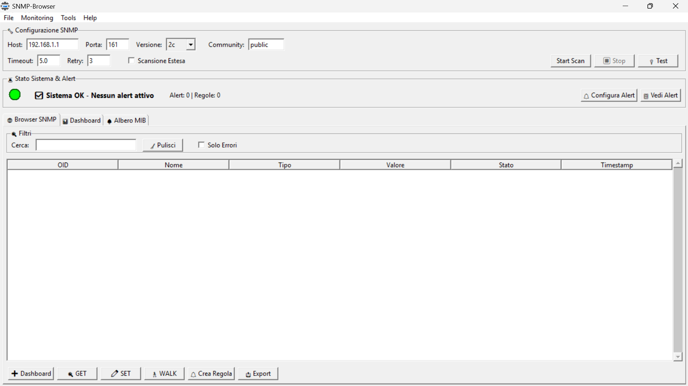

# SNMP Browser Professional

<div align="center">
  
  <p><em>Main SNMP Browser Interface with Advanced Monitoring</em></p>
</div>

Advanced SNMP browser with modern GUI for network device discovery, monitoring, alerting, and performance analysis.


## 🚀 Features

### Core Capabilities
- **SNMPv1/v2c/v3 Support** - Complete SNMP protocol support with authentication and encryption
- **Modern GUI Interface** - Professional tabbed interface built with tkinter
- **Multi-Language Support** - 13 languages including English, Spanish, French, German, Italian, Chinese, Japanese, Portuguese, Russian, Swedish, Arabic, Hindi, and Hungarian
- **Cross-Platform** - Native support for Windows, Linux, and macOS with OS-appropriate data storage
- **Network Device Discovery** - Browse and explore SNMP-enabled devices
- **Real-time Monitoring** - Live monitoring with auto-refresh capabilities (active by default)
- **Advanced MIB Browser** - Navigate through SNMP MIB structures with hierarchical tree view

### 🆕 Advanced Monitoring Features
- **Alert System** - Comprehensive rule-based monitoring
  - Create custom alert rules with flexible conditions (>, <, =, ≠, contains, etc.)
  - Real-time monitoring of OID values against thresholds
  - Visual status indicators (🟢 OK / 🔴 Alert / 🟡 Warning)
  - Alert cooldown to prevent notification spam
  - Alert history with timestamp tracking
  - Desktop notifications for triggered alerts
  
- **Email Notifications** - Automated alert delivery
  - SMTP server configuration with TLS support
  - Encrypted password storage for email credentials
  - Send alerts via email when rules are violated
  - Test email functionality before deployment
  - Configurable per-rule email recipients

- **Real-time Graphs** - Visual data analysis
  - Historical data tracking (up to 100 points per OID)
  - Full-screen graph windows with matplotlib
  - Mini-graphs in dashboard for quick overview
  - Statistical analysis (min, max, average, trend)
  - Save graphs as PNG images
  - Automatic data cleanup (24-hour retention)

- **Dashboard Enhancements**
  - Auto-refresh enabled by default (configurable 5-300 seconds)
  - Live trend indicators (↗️ ↘️ ➡️)
  - Alert status column showing rule violations
  - Statistics panel with real-time metrics
  - One-click graph generation from dashboard
  - Persistent data across sessions

### 🔧 Professional Tools
- **Trap Manager** - Complete trap receiver and sender
  - Receive SNMP traps on configurable ports
  - Send test traps for all versions (v1/v2c/v3)
  - Pre-configured trap templates (Cold Start, Link Down, UPS alerts, etc.)
  - Real-time trap visualization with detailed decoding

- **Performance Monitor** - Track and analyze operations
  - Query response times and success rates
  - Memory and CPU usage monitoring
  - Performance graphs (with matplotlib)
  - Export performance metrics

- **Batch Operations** - Multi-host queries
  - Parallel execution with configurable workers
  - Progress tracking and result aggregation
  - Export results to CSV/JSON

- **MIB Compiler Support** - Custom MIB management
  - Full ASN.1 MIB parser with regex-based parsing
  - Import .mib, .txt, and .my files
  - Automatic OID name resolution
  - Built-in UPS MIB definitions (RFC 1628)
  - Support for custom vendor MIBs
  - MIB management interface (view, remove, export)
  - Real-time OID description updates

- **Profile Manager** - Configuration management
  - Save and manage multiple device configurations
  - Quick switch between profiles
  - Encrypted credential storage
  - Import/Export profiles

### Security & Enterprise Features
- **Encrypted Credential Storage** - Fernet-based encryption for passwords
- **Secure Memory Management** - Secure deletion of sensitive data with garbage collection
- **Memory Limits** - Configurable result (100-100K) and memory (50-2000MB) limits
- **Comprehensive Logging** - Rotating log files with debug, info, warning, error levels
- **Multi-format Export** - CSV, JSON, HTML, XML, TXT with metadata
- **OS-Appropriate Data Storage** - Windows (AppData), macOS (Library), Linux (~/.config)

## 📥 Download

Download the latest pre-built executable from the [Releases](https://github.com/JustVugg/Snmp-Browser/releases) page.

**Windows**: `SNMP_Browser_Professional_v3.5.exe` - Just download and run!  
**Linux**: `SNMP_Browser_Professional_v3.5` - Make executable with `chmod +x`  
**macOS**: `SNMP_Browser_Professional_v3.5.app` - Double-click to run

## 🛠️ Installation from Source

### 📦 SNMP Library Dependency

> **Required Library: [snmpy](https://github.com/snmpware/snmpy)**
>
> This SNMP library is **required to run SNMP Browser Professional**.
> It is not available on PyPI and must be installed directly from GitHub:

**Option 1: Using pip**
```bash
pip install git+https://github.com/snmpware/snmpy.git
```

**Option 2: Manual installation**
```bash
git clone https://github.com/snmpware/snmpy.git
cd snmpy
python3 setup.py install
```

### Prerequisites
```bash
pip install -r requirements.txt
```

**Required packages:**
- `cryptography>=41.0.0` - Encryption support for SNMPv3 and credential storage
- `psutil>=5.9.0` - System monitoring and resource management
- `snmpy` - Advanced SNMP library (from GitHub)
- `Pillow>=10.0.0` - Image processing for logo display
- `matplotlib>=3.5.0` - Required for graphs and performance monitoring

### Running from Source
```bash
git clone https://github.com/yourusername/snmp-browser-professional.git
cd snmp-browser-professional
pip install -r requirements.txt
python snmp_browser_professional.py
```

## 🏗️ Building Executables

### Windows
```bash
pyinstaller --onefile --windowed --icon=icon.ico ^
    --add-data="icon.png;." ^
    --add-data="icon.ico;." ^
    --hidden-import=cryptography ^
    --hidden-import=psutil ^
    --hidden-import=snmpy ^
    --hidden-import=PIL ^
    --hidden-import=matplotlib ^
    --collect-all=snmpy ^
    --collect-all=cryptography ^
    --collect-all=psutil ^
    --collect-all=matplotlib ^
    --name=SNMP_Browser_Professional_v3.5 snmp_browser_professional.py
```

### Linux/Ubuntu
```bash
pyinstaller --onefile --windowed --icon=icon.png \
    --add-data="icon.png:." \
    --hidden-import=cryptography \
    --hidden-import=psutil \
    --hidden-import=snmpy \
    --hidden-import=PIL \
    --hidden-import=matplotlib \
    --collect-all=snmpy \
    --collect-all=cryptography \
    --collect-all=psutil \
    --collect-all=matplotlib \
    --name=SNMP_Browser_Professional_v3.5 snmp_browser_professional.py
```

### macOS
```bash
pyinstaller --onefile --windowed --icon=icon.icns \
    --add-data="icon.png:." \
    --hidden-import=cryptography \
    --hidden-import=psutil \
    --hidden-import=snmpy \
    --hidden-import=PIL \
    --hidden-import=matplotlib \
    --collect-all=snmpy \
    --collect-all=cryptography \
    --collect-all=psutil \
    --collect-all=matplotlib \
    --name=SNMP_Browser_Professional_v3.5 snmp_browser_professional.py
```

## 💻 System Requirements

- **Operating System**: Windows 10/11, Ubuntu 20.04+, or macOS 10.14+
- **Python**: 3.7 or higher (for source installation)
- **Memory**: 512 MB RAM minimum (1 GB recommended)
- **Network**: Access to SNMP-enabled devices
- **Permissions**: Admin/root for trap receiver on port 162

## 🚦 Quick Start Guide

### Basic SNMP Browsing
1. Launch the application
2. Enter target device IP address
3. Select SNMP version (1, 2c, or 3)
4. Configure credentials (community string or SNMPv3 user)
5. Click "Avvia Scansione" to discover OIDs
6. Browse results in the main tab

### Setting Up Monitoring & Alerts
1. **Create Alert Rules**:
   - In results browser, right-click an OID → "🔔 Crea Regola"
   - Or go to Menu → Monitoring → "Gestisci Regole Alert"
   - Set condition (>, <, =, ≠, contains) and threshold value
   - Choose action: Desktop notification, Email, or Both
   - Rule monitors automatically in background (every 10 seconds)

2. **Configure Email Alerts**:
   - Menu → Monitoring → "📧 Configura Email"
   - Enter SMTP server details (e.g., smtp.gmail.com:587)
   - Provide credentials (stored encrypted)
   - Test configuration with "📧 Test" button

3. **View Alert Status**:
   - Top alert status bar shows system state (🟢/🔴)
   - Dashboard "🔔" column indicates alerts per item
   - Menu → Monitoring → "📊 Visualizza Alert History" for full log

### Using Graphs & Historical Data
1. **View Graphs**:
   - In dashboard, select an item
   - Click "📊 Grafico" for full-screen graph
   - Or view mini-graph in right panel automatically

2. **Graph Features**:
   - Shows last 100 data points (up to 24 hours)
   - Statistical analysis (min, max, average)
   - Trend line and markers
   - Save as PNG image

3. **Data Management**:
   - Historical data saved automatically
   - Menu → Tools → "💾 Salva Dati Storici" to force save
   - "🧹 Pulisci Dati Vecchi" removes data >24h old

### Importing Custom MIBs
1. Menu → Tools → "📥 Importa MIB Custom"
2. Select one or more .mib, .txt, or .my files
3. Parser extracts OID definitions automatically
4. OID names update immediately in all views
5. Manage imported MIBs via "📚 Gestisci MIB"

### Auto-Refresh Dashboard
- **Enabled by default** with 30-second interval
- Toggle with "🔄 Auto-Refresh" checkbox
- Adjust interval (5-300 seconds) in spinbox
- Dashboard updates automatically with:
  - Current values
  - Alert status
  - Trend indicators
  - Mini-graphs

### Using Trap Manager
1. Go to "Trap Manager" tab
2. **Receiver**: Click "Avvia Receiver" (requires admin for port 162)
3. **Sender**: Configure destination and select trap type
4. Click "📤 Invia Trap" to send

### Batch Operations
1. Menu → Tools → "Operazioni Batch"
2. Enter multiple host IPs (one per line)
3. Specify OID to query
4. Click "Esegui" for parallel execution

### Performance Monitoring
1. Go to "Performance" tab
2. View real-time metrics after operations
3. Export data for analysis

## 🌍 Multi-Language Support

SNMP Browser Professional supports 13 languages out of the box:

- 🇬🇧 English (en)
- 🇪🇸 Spanish (es) - Español
- 🇫🇷 French (fr) - Français
- 🇩🇪 German (de) - Deutsch
- 🇮🇹 Italian (it) - Italiano
- 🇨🇳 Chinese (zh) - 中文
- 🇯🇵 Japanese (ja) - 日本語
- 🇵🇹 Portuguese (pt) - Português
- 🇷🇺 Russian (ru) - Русский
- 🇸🇪 Swedish (sv) - Svenska
- 🇸🇦 Arabic (ar) - العربية
- 🇮🇳 Hindi (hi) - हिन्दी
- 🇭🇺 Hungarian (hu) - Magyar

### Changing Language
1. Go to **Help** → **Language**
2. Select your preferred language
3. Click **Apply**
4. Restart the application

### Adding New Languages
Want to add your language? See the [LANGUAGE_GUIDE.md](LANGUAGE_GUIDE.md) for step-by-step instructions. Contributions are welcome!

## 🔧 Configuration Files

The application automatically stores data in OS-appropriate locations:

**Windows**: `%LOCALAPPDATA%\SNMPBrowser\`  
**macOS**: `~/Library/Application Support/SNMPBrowser/`  
**Linux**: `~/.config/SNMPBrowser/`

Configuration files created:
- `snmp_browser_config.json` - Main configuration (includes language preference)
- `snmp_browser_saved.json` - Dashboard items
- `snmp_browser_rules.json` - Alert rules and thresholds
- `snmp_browser_email.json` - Email configuration (passwords encrypted)
- `snmp_browser_historical.json` - Historical data for graphs
- `snmp_browser_custom_mibs.json` - Imported MIB definitions
- `snmp_profiles.json` - Saved connection profiles
- `languages.json` - Multi-language translations
- `.SNMPBrowser_key` - Encryption key (keep secure!)
- `logs/` - Directory containing rotating log files

**View Data Location**: Menu → Tools → "📁 Posizione Dati"

## 📊 Supported Operations

### SNMP Operations
- GET - Retrieve single OID value
- GET MULTIPLE - Retrieve multiple OIDs efficiently
- GET NEXT - Get next OID in tree
- GET BULK - Bulk retrieval (v2c/v3)
- SET - Modify writable OIDs
- WALK - Traverse MIB subtree

### Alert Rule Conditions
- `less_than` (<) - Trigger when value is less than threshold
- `less_than_or_equal` (≤) - Trigger when value is less or equal
- `greater_than` (>) - Trigger when value exceeds threshold
- `greater_than_or_equal` (≥) - Trigger when value is greater or equal
- `equal` (=) - Trigger when value matches exactly
- `not_equal` (≠) - Trigger when value differs
- `contains` - Trigger when string contains text

### Trap Types Supported
- Standard: Cold Start, Warm Start, Link Up/Down, Authentication Failure
- UPS-specific: Battery Low, On Battery, Overload, Temperature
- Custom enterprise traps with configurable varbinds

## 🔐 Security Features

- **SNMPv3 Full Support**: All authentication (MD5, SHA, SHA256, SHA384, SHA512) and privacy (DES, AES128, AES192, AES256) protocols
- **Encrypted Storage**: All passwords encrypted at rest using Fernet (256-bit AES)
- **Secure Memory Management**: Passwords securely deleted from memory with forced garbage collection
- **Memory Protection**: Configurable limits prevent memory exhaustion
- **Access Control**: Configurable timeouts and retry limits
- **Audit Trail**: Comprehensive logging of all operations with rotation

## 📝 MIB Support

### Built-in MIBs
- RFC 1213 - MIB-II
- RFC 1628 - UPS MIB
- Enterprise MIBs: APC (318), Eaton (534), CyberPower (3808), Cisco, Microsoft, HP, Dell, IBM, Intel

### Custom MIB Parser
The integrated MIB parser supports:
- **ASN.1 Syntax**: Full parsing of MIB definition files
- **Object Types**: OBJECT-TYPE, OBJECT IDENTIFIER, MODULE-IDENTITY, NOTIFICATION-TYPE, OBJECT-GROUP
- **Imports**: Resolves imported definitions across MIBs
- **Standard Roots**: Automatic resolution of iso, org, dod, internet, enterprises paths
- **Multiple Formats**: .mib, .txt, .my file extensions

### Loading Custom MIBs
1. Menu → Tools → "📥 Importa MIB Custom"
2. Select one or more MIB files
3. Progress dialog shows parsing status
4. OID names automatically update in all views
5. Manage via "📚 Gestisci MIB" (view details, remove, export list)

## 🤝 Contributing

Contributions are welcome! Please follow these steps:

1. Fork the repository
2. Create a feature branch (`git checkout -b feature/amazing-feature`)
3. Commit your changes (`git commit -m 'Add amazing feature'`)
4. Push to the branch (`git push origin feature/amazing-feature`)
5. Open a Pull Request

### Development Setup
```bash
# Clone with submodules
git clone --recursive https://github.com/yourusername/snmp-browser-professional.git

# Install dev dependencies
pip install -r requirements-dev.txt

# Run tests
python -m pytest tests/
```

## 📄 Requirements.txt
```
cryptography>=41.0.0
psutil>=5.9.0
Pillow>=10.0.0
matplotlib>=3.5.0
git+https://github.com/snmpware/snmpy.git
```

### Development Requirements
```
pytest>=7.0.0
black>=22.0.0
flake8>=4.0.0
pyinstaller>=5.0
```

## 🐛 Troubleshooting

### Common Issues

**"Permission denied" on trap receiver**
- Run as administrator (Windows) or with sudo (Linux/macOS)
- Or change trap port to >1024 (e.g., 1162)

**"Module not found" errors**
- Ensure all dependencies are installed: `pip install -r requirements.txt`
- Install matplotlib: `pip install matplotlib --upgrade`
- Verify snmpy: `pip install git+https://github.com/snmpware/snmpy.git`

**High memory usage**
- Adjust limits in Settings → Limiti
- Clear cache with Tools → Pulisci Cache
- Clean old historical data: Tools → "🧹 Pulisci Dati Vecchi"

**SNMPv3 discovery fails**
- Check firewall settings
- Verify SNMPv3 credentials
- Try manual Engine ID discovery: "🎯 Scopri Engine ID"

**Email alerts not working**
- Verify SMTP configuration
- Use "📧 Test" button to diagnose
- Check firewall allows outbound SMTP (port 587/465)
- For Gmail: enable "App Passwords" in account settings

**Graphs not showing**
- Ensure matplotlib is installed: `pip install matplotlib`
- Check historical data exists (needs at least 2 data points)
- Wait for auto-refresh to collect data

**MIB import fails**
- Check MIB file syntax (must be valid ASN.1)
- Review import errors in progress dialog
- Some vendor MIBs may require dependencies

## 📈 Performance Tips

- Use SNMPv2c or v3 for bulk operations (10x faster than v1)
- Enable "Scansione Estesa" only when needed
- Set appropriate timeout values for your network (default 5s)
- Use profiles for quick device switching
- Limit walk operations to specific subtrees
- Adjust auto-refresh interval based on network load
- Clean old historical data regularly to save disk space
- Use batch operations for multi-host queries

## 📝 License

This project is licensed under the GNU General Public License v3.0 - see the [LICENSE](LICENSE) file for details.

## 🙏 Acknowledgments

- **SNMP Library**: [snmpy](https://github.com/snmpware/snmpy) by [snmpware](https://github.com/snmpware)
- **GUI Framework**: [tkinter](https://docs.python.org/3/library/tkinter.html)
- **Graphing**: [matplotlib](https://matplotlib.org/)
- **Encryption**: [cryptography](https://cryptography.io/)
- **Icons**: Material Design Icons
- **Executable Packaging**: [PyInstaller](https://pyinstaller.readthedocs.io/)

## 📞 Support

- **Bug Reports**: Open an issue with debug logs attached (Menu → Help → "📊 Log Viewer")
- **Feature Requests**: Use the issue template
- **Security Issues**: Contact privately first
- **Documentation**: Check built-in help (F1 key)

---

**SNMP Browser Professional v3.5** - Enterprise-grade SNMP management with advanced monitoring, alerting, and visualization 🚀

*Making network monitoring simple, powerful, secure, and proactive!*

**New in v3.5**:
- 🔔 Comprehensive alert system with rule-based monitoring
- 📧 Email notifications for critical alerts
- 📈 Real-time graphs with historical data tracking
- 🔄 Auto-refresh dashboard (active by default)
- 📥 Custom MIB parser with ASN.1 support
- 🌍 Cross-platform data storage
- 💾 Persistent monitoring across sessions
